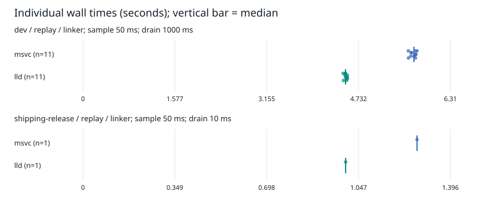

**Windows linker measurements**

Campaign: 20260913-main. Generated 2026-09-14T05:03:37.1285123Z.

Wall time includes native process creation and stops at the dedicated process-exit waiter. Memory commit is the OS job high-water mark. Resident memory/thread peaks are observed samples. Process I/O is not physical disk traffic. Failed runs, warmups, preparations and traced runs are never pooled into baseline speedups. Raw data and diagnostic runs remain in runs.jsonl/runs.csv.

Memory-mapped reads/writes can bypass the process read/write counters. Large I/O-counter differences between these linkers must not be interpreted as equivalent reductions in physical disk traffic.

**dev / replay / linker** — 11 complete pairs; sampling 50 ms; LLD threads 0 (0 means default).

| Metric | MSVC median | LLD median | Median paired reduction | 95% bootstrap interval |
| --- | ---: | ---: | ---: | ---: |
| wall_s | 5,683 | 4,508 | 20,43% | [19,42; 21,12]% |
| tree_cpu_s | 13,094 | 14,125 | -6,41% | [-8,36; -2,77]% |
| peak_tree_commit_bytes (MiB) | 2 886,660 | 1 499,055 | 48,07% | [47,98; 48,11]% |
| observed_peak_working_set_bytes (MiB) | 5 189,164 | 4 719,934 | 9,06% | [8,62; 9,46]% |
| read_bytes (MiB) | 3 037,000 | 0,284 | 99,99% | [99,99; 99,99]% |
| write_bytes (MiB) | 739,184 | 0,017 | 100,00% | [100,00; 100,00]% |
| tree_page_faults | 1 916 943,000 | 1 352 971,000 | 29,42% | [29,32; 30,08]% |
| exe_bytes (MiB) | 165,321 | 165,318 | 0,00% | [0,00; 0,00]% |
| pdb_bytes (MiB) | 742,379 | 830,273 | -11,84% | [-11,84; -11,84]% |

**shipping-release / replay / linker** — 1 complete pairs; sampling 50 ms; LLD threads 0 (0 means default).

| Metric | MSVC median | LLD median | Median paired reduction | 95% bootstrap interval |
| --- | ---: | ---: | ---: | ---: |
| wall_s | 1,269 | 0,998 | 21,37% | insufficient pairs |
| tree_cpu_s | 1,688 | 1,969 | -16,67% | insufficient pairs |
| peak_tree_commit_bytes (MiB) | 741,910 | 103,414 | 86,06% | insufficient pairs |
| observed_peak_working_set_bytes (MiB) | 836,559 | 606,594 | 27,49% | insufficient pairs |
| read_bytes (MiB) | 312,711 | 0,114 | 99,96% | insufficient pairs |
| write_bytes (MiB) | 124,224 | 0,017 | 99,99% | insufficient pairs |
| tree_page_faults | 433 371,000 | 168 323,000 | 61,16% | insufficient pairs |
| exe_bytes (MiB) | 109,646 | 109,641 | 0,00% | insufficient pairs |
| pdb_bytes (MiB) | 124,902 | 125,020 | -0,09% | insufficient pairs |

**Collector calibration**

- dev, lld: median sampling-on wall-time change 2,68% across 3 pairs. This includes run noise; inspect raw runs before interpreting it as overhead.
- dev, msvc: median sampling-on wall-time change 2,88% across 3 pairs. This includes run noise; inspect raw runs before interpreting it as overhead.

Retained failed runs: 4. Bootstrap resamples whole pairs (2000 replicates, seed 20260913). Tail p95 is populated in summary.csv only for groups with at least 30 successful observations.

Compatibility evidence is retained in per-run artifacts.json, smoke-version.log, pe-headers.txt, pe-dependents.txt and pdb-validation.txt. GUI and interactive debugger checks are separate from the timing campaign. Optional ETW files require inspection for provider coverage/event loss before drawing disk or scheduling conclusions.

