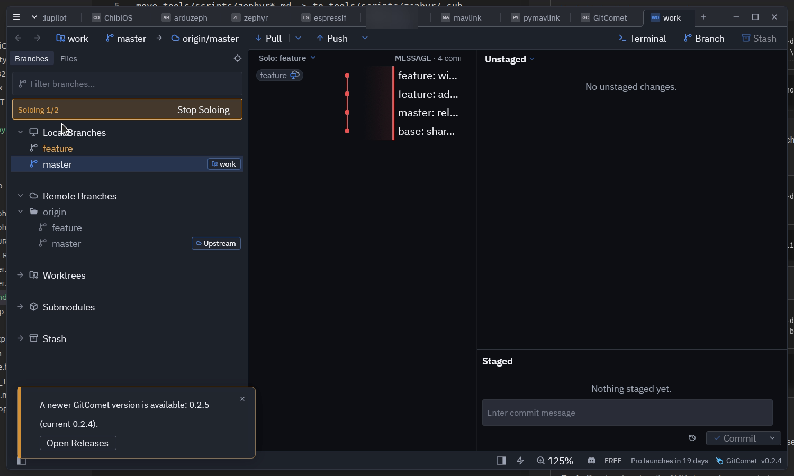
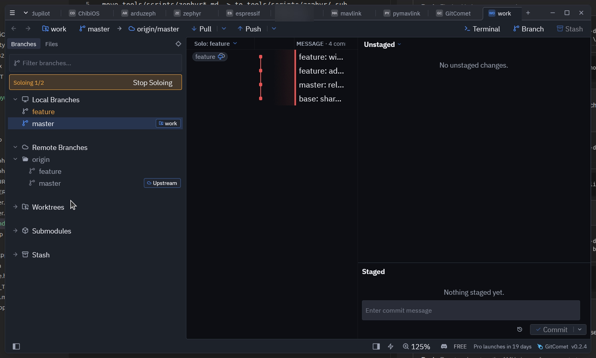
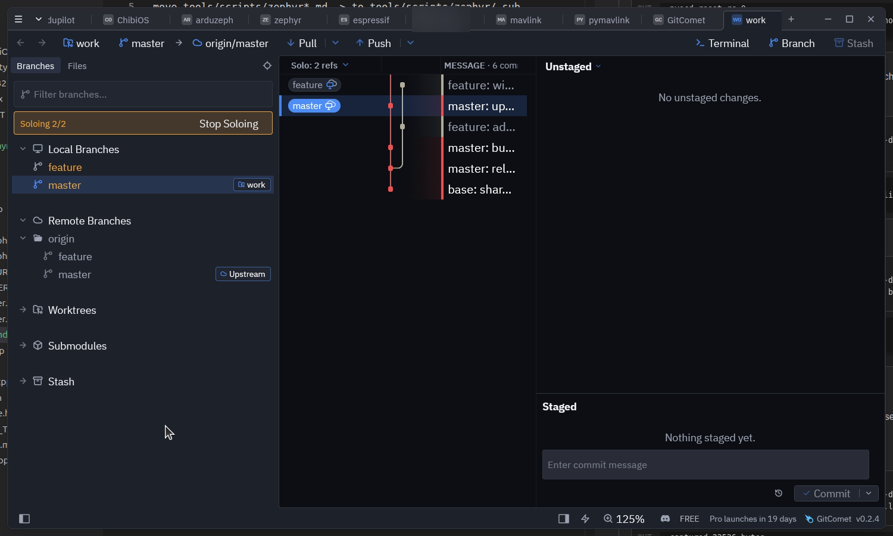
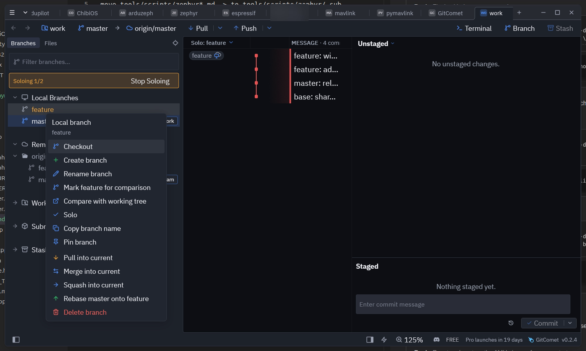

# Solo

Solo narrows the history to the refs you pick. Right-click a local branch, a
remote branch or a remote in the sidebar and choose **Solo**: the history walk
is reseeded from that ref, so the graph shows only the commits it reaches. The
same entry, now ticked, takes the ref back out.

The entry also appears on the ref badges in history rows, which reuse the
branch menu.

## What it does to the walk

Solo replaces the walk's *seed*, not its *mode*. A soloed first-parent walk
still follows first parents; it just starts at the soloed ref instead of HEAD.
So solo composes with every entry in the history-mode menu rather than
competing with it.

Soloing one branch leaves the branch and everything it reaches:

## Soloing several refs

Solo is a set. Each menu entry toggles its own ref, and the walk seeds from all
of them, so soloing two branches shows the union of what they reach — which is
how you read two lines of development with the rest of the repository out of
the way.

Soloing a whole remote seeds from every branch that remote tracks.

## Finding your way out

Soloed rows are drawn in mustard, and a mustard banner above the branch list
reads `Soloing x/y` — soloed refs over local branches — with **Stop Soloing**
to clear the set in one click.

A soloed ref's own menu entry carries a tick, and picking it again removes just
that ref:

The history header chip names the soloed ref, or counts them when there are
several, and its menu can stop soloing too.

## Notes

- The solo set is remembered per repository, alongside the history mode and the
  author filter.
- A soloed ref that is deleted or pruned drops out of the set on its own, and
  the rest of the solo stands.
